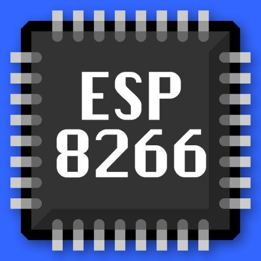
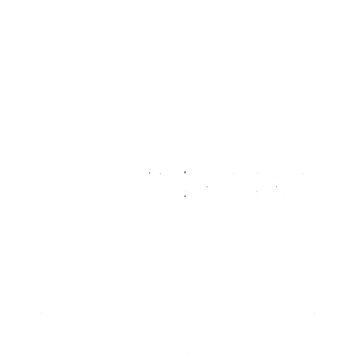

  

  
  

  
  <!--  -->
  
  

<h1 align="center">
  Привет, мир
  
</h1>

  

  

---
## :ru: 
### :technologist: Обо мне :
Я Герман, на данный момент мне 16 лет и я Intern+ программист микроконтроллеров, однако переучиваюсь на Backend-разработчика.

### :hammer_and_wrench: Мои навыки:

  &nbsp;
  &nbsp;
  &nbsp;
  &nbsp;
  &nbsp;
  &nbsp;
  &nbsp;
  &nbsp;
  &nbsp;

#### :pushpin: А также:
:satellite:На базовом уровне я знаю интерфейсы связи (I2C, UART, SPI). Разрабатывал связь плат с помощью разных протоколов (TCP/IP, HTTP, UART) и создавал свои парсеры для них. Поднимал WebServer на ESP. Работал с разными платами Arduino (Nano, Uno, Mega) и ESP (ESP01/12/32/8266, Wemos D1). Также задумывался об обучении разработке для STM32 микроконтроллеров.

### :1st_place_medal: Достижения и портфолио:
[Мое портфолио](https://github.com/Fompi06/Fompi06/tree/main/%D0%95%D1%81%D1%82%D1%8C%20%D1%87%D0%B5%D0%BC%20%D0%B3%D0%BE%D1%80%D0%B4%D0%B8%D1%82%D1%8C%D1%81%D1%8F%26There%20is%20something%20to%20be%20proud%20of)

### :one:
Мы участвовали во Всероссийском конкурсе по стратоспутникам и заняли 2 место из 5 в финале. Я состоял в команде из 3-х человек и отвечал за написание почти всей прошивки для Arduino Mega и Desktop приложения, написанного на Processing. \

Ссылка на исходные материалы проекта и конкурса:
[Исходный код](https://github.com/Fompi06/InsectoSputnik) \
[Сайт конкурса](http://stratosputnik.ru/)

### :two:
Мой собственный проект, который еще находится в разработке

#### Кратко о проекте:
Данный проект построен на Arduino и языке C++. Идея проекта заключается в помощи решения главной проблемы здоровья программистов, а именно - сидячий образ жизни. Суть проекта: оповещать человека о том, что пора размяться, прогуляться, отдохнуть от компьютера и т.д. И наоборот, оповещать о том, что человек отдыхает слишком долго и пора работать дальше.

В проекте есть удобная настройка продолжительности таймеров, видов оповещений и других настроек. Также из дополнительных функций: 
+ Вывод текущей температуры и влажности в воздухе с помощью датчика 
+ Ведение графиков часов, проведенных за работой в день, температур и влажностей за последние 5 дней.

В будущем я планирую реализовать связь с компьютером с помощью Qt/Processing. Также добавлю:
+ Независимые таймеры
+ Более удобное ведение графиков 
+ Получение прогноза погоды из интернета через тот же Qt/Processing.

[Исходный код](https://github.com/Fompi06/Room-Assistant)

### :memo: Будущие идеи
#### :world_map: Навигатор оптимального маршута
Никому не удивительно слышать, что в России есть платные дороги, недавно мы были в путешествии и довольно удивились, насколько быстро можно добраться из одного города в другой по этим дорогам, и... насколько это дорого! Однако, можно, например, проехать полпути по платной дороге, затем съехать на бесплатную дорогу и заплатить за это полцены. На таких дорогах есть много мест, где можно заехать и можно съехать, и у каждого цена отличается. К сожалению, навигаторы Yandex и Google не умеют рассчитывать самый быстрый маршут за определенную цену. 

Цель проекта: находить самый быстрый маршут, комбинируя маршуты по платным и бесплатным дорогам, учитывая пробки и происшествия на дороге за определенную цену. Например, если пользователь хочет заплатить за проезд из одного города в другой 1000 рублей, то мой проект поможет найти самый быстрый маршут по бесплатным и платным дорогам, цена которых не должна превышать 1000 рублей.

Данный проект поможет мне изучить множество Backend-технологий (Базы данных, сервера, работа с API навигаторов и карт, с API сервисов, предоставляющих цены на платные дороги и т.д.)

#### :timer_clock: Виртуальный [Room Assistant](https://github.com/Fompi06/Room-Assistant)
Проблема моего прошлого Room Assistant в том, что для его использования необходимо купить оборудование (микроконтроллер, датчики, корпус и т.д.). Я хочу переделать данный проект в мобильное и Desktop приложение, чтобы снизить порог использования мои проектом. 

Данный проект поможет мне изучить, как разрабатываются мобильные и Desktop приложения, а так же подробнее изучить язык программирования Java/Qt с C++

## :eu: 

### :technologist: About me :
I'm German, I'm currently 16 years old and I'm an Intern+ microcontroller programmer, but I'm retraining as a Backend developer.

### :hammer_and_wrench:My skills:

  &nbsp;
  &nbsp;
  &nbsp;
  &nbsp;
  &nbsp;
  &nbsp;
  &nbsp;
  &nbsp;
  &nbsp;

#### :pushpin: And also:
:satellite: At the basic level, I know communication interfaces (I2C, UART, SPI).
Developed board communication using different communication protocols (TCP/IP, HTTP, UART) and made my own parsers for them. Raised WebServer on ESP. I worked with different Arduino boards (Nano, Uno, Mega) and ESP (ESP01/12/32/8266, Wemos D1), thought about learning to develop STM32 microcontrollers.

### :1st_place_medal: Achievements and portfolio:
[My portfolio](https://github.com/Fompi06/Fompi06/tree/main/%D0%95%D1%81%D1%82%D1%8C%20%D1%87%D0%B5%D0%BC%20%D0%B3%D0%BE%D1%80%D0%B4%D0%B8%D1%82%D1%8C%D1%81%D1%8F%26There%20is%20something%20to%20be%20proud%20of)

### :one:
We participated in the All-Russian competition for stratosputniks and took 2nd place out of 5 in the final. I was part of a team of 3 people and was responsible for writing almost all the firmware for the Arduino Mega and the Desktop application written in Processing.

Link to the source materials of the project and the competition:
[Source code](https://github.com/Fompi06/InsectoSputnik) \
[Contest website](http://stratosputnik.ru/)

### :two:
My own project which is still in development

#### Briefly about the project:
This project is built on Arduino and C++. The idea of the project is to help solve the main health problem of programmers, namely, a sedentary lifestyle. The essence of the project: to notify a person that it is time to warm up, take a walk, take a break from the computer, etc. And vice versa, notify that a person is resting for too long and it's time to work on. 

The project has a convenient setting for the duration of timers, types of notifications and other settings. Also from additional functions: 
+ Displaying the current temperature and humidity in the air using a sensor
+ Maintaining graphs of hours spent at work per day, temperatures and humidity for the last 5 days.

In the future, I will implement communication with a computer using Qt / Processing, I will also add independent:
+ Timers 
+ More convenient graphing
+ Getting weather forecasts from the Internet through the same Qt / Processing. 

[Source Code](https://github.com/Fompi06/Room-Assistant)

### :memo: Future Ideas
#### :world_map: Optimal route navigator
No one is surprised to hear that there are toll roads in Russia, we were recently on a trip and were quite surprised how quickly you can get from one city to another along these roads, and ... how expensive it is! However, you can, for example, drive halfway on a toll road, then turn off onto a free road and pay half the price for it. On such roads there are many places where you can enter and leave, and each has a different price. Unfortunately, Yandex and Google navigators do not know how to calculate the fastest route for a certain price.

The goal of the project: to find the fastest route by combining routes on toll and free roads, taking into account traffic jams and accidents on the road for a certain price. For example, if a user wants to pay 1000 rubles for travel from one city to another, then my project will help find the fastest route on free and toll roads, the price of which should not exceed 1000 rubles.

This project will help me learn a lot of Backend technologies (Databases, servers, working with the API of navigators and maps, with the API of services that provide prices for toll roads, etc.)

#### :timer_clock: Virtual [Room Assistant](https://github.com/Fompi06/Room-Assistant)
The problem with my past Room Assistant is that you need to buy hardware (microcontroller, sensors, case, etc.) to use it. I want to convert this project into a mobile and desktop application in order to lower the usage threshold for my project.

This project will help me learn how mobile and desktop applications are developed, as well as learn more about the Java / Qt programming language with C ++
<!-- - 👋 Hi, I’m @Fompi06
- 👦I am 16 years old. I am an intern embedded developer. I also want to become a backend or software developer.
- 👀 I’m interested in programming
- 🌱 I’m currently learning C/C++, Embedded, Arduino, STM technologies, Python and Java
- 💞️ I’m looking to collaborate on Google, Yandex and ???
- 📫 How to reach me https://vk.com/gkhayrullin and https://t.me/Germanhairullin -->

<!---
Fompi06/Fompi is a ✨ special ✨ repository because its `README.md` (this file) appears on your GitHub profile.
You can click the Preview link to take a look at your changes.
--->
